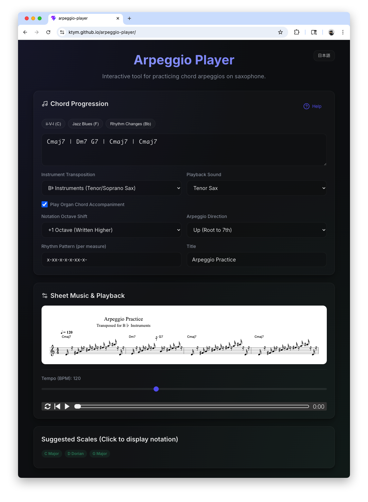

# Arpeggio Player

Arpeggio Player is an interactive web application designed for practicing musical arpeggios and scales, with a special focus on transposing instruments like the saxophone (Tenor, Alto, Soprano, Baritone). It automatically generates readable sheet music from chord progressions and provides audio playback using high-quality MIDI soundfonts.



## Features

- **Automated Arpeggio Generation**: Input a sequence of chords (e.g., `Cmaj7 | Dm7 G7 | Cmaj7`) to automatically generate musical notation for arpeggios.
- **Custom Rhythm Patterns**: Control the rhythmic subdivision of the arpeggio directly via text input (e.g., `x-xx-x-x-` for complex 16th note rhythms).
- **Arpeggio Directions**: Practice both ascending (Root to 7th), descending (7th to Root), and randomized arpeggios.
- **Full Transposition Support**: Optimized for woodwind and brass players. Toggle between Concert Pitch, B♭ instruments, and E♭ instruments for accurate notation.
- **Notation Octave Shift**: Read sheet music in the most comfortable register for your instrument (e.g., moving Tenor Sax notation up an octave to avoid excessive ledger lines) without affecting the correct MIDI playback octave.
- **Multiple Playback Sounds**: Select between Piano, Soprano Sax, Alto Sax, Tenor Sax, and Baritone Sax for the main melody.
- **Organ Chord Accompaniment**: Optionally enable an underlying organ backing track that sustains and dynamically follows the parsed chord progression.
- **Suggested Scales**: The app analyzes your chord progression and suggests relevant scales for improvisation. Click any suggested scale to instantly view and hear its notation.
- **Bilingual Interface**: Seamlessly switch between English and Japanese interfaces.

## Getting Started

### Prerequisites
Make sure you have [Node.js](https://nodejs.org/) installed on your machine.

### Installation
Clone or download the repository, then install the dependencies:
```bash
npm install
```

### Starting the Application
Run the local Vite development server:
```bash
npm run dev
```
By default, the application will be accessible in your web browser at:
`http://localhost:5173/`

### Changing the Port
If you want to start the application on a different port (for example, port `3000`), you can pass the `--port` flag to the start command:
```bash
npm run dev -- --port 3000
```
This will launch the app at `http://localhost:3000/`.

### Stopping the Application
To stop the development server, go to the terminal where it is running and press `Ctrl + C`.

## Tech Stack & Dependencies

This application is built with modern web technologies and relies on the following key libraries:
- **[React](https://react.dev/)**: The core UI framework.
- **[Vite](https://vitejs.dev/)**: For fast, modern frontend tooling and building.
- **[abcjs](https://paulrosen.github.io/abcjs/)**: Used for rendering sheet music notation and providing high-quality MIDI playback using SoundFonts.
- **[@tonaljs/tonal](https://github.com/tonaljs/tonal)**: A comprehensive music theory library used to parse chords, calculate arpeggio notes, determine intervals, and suggest musical scales.
- **[lucide-react](https://lucide.dev/)**: For clean, modern SVG icons.

## License

This project is open-sourced under the **MIT License**. See the [LICENSE](LICENSE) file for more details.

## Author

**Toshiaki Katayama** \<k@bioruby.org\>

*(Code generation and implementation assisted by Google DeepMind's Antigravity / Gemini model)*
